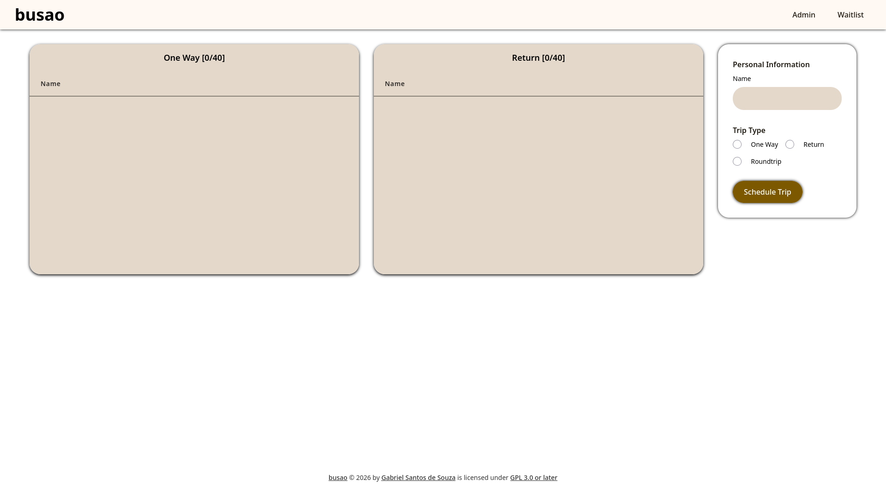

<!--
SPDX-FileCopyrightText: 2026 Gabriel Santos de Souza <gabriel.santosdesouza@dcomp.ufs.br>

SPDX-License-Identifier: CC-BY-4.0
-->

# [busao: Bus Vacancy Management System](https://gbr-ufs.github.io/busao/)

## Introduction

busao is a bus vacancy management system built with [HTMX](https://htmx.org/) with a [SQLite](https://sqlite.org/) database, to manage who and how many people can go on a bus trip.

## Philosophies

- Dependency Injection.
- Domain-Driven Design[^1].

## References

[^1]: Millett, S. and Tune, N. (2015) Patterns, principles, and practices of domain-driven design. Indianapolis, IN: Wrox, a Wiley brand.
